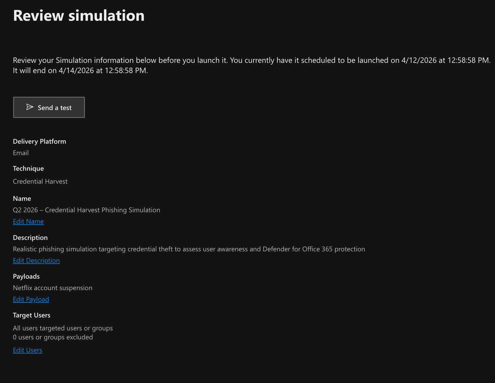
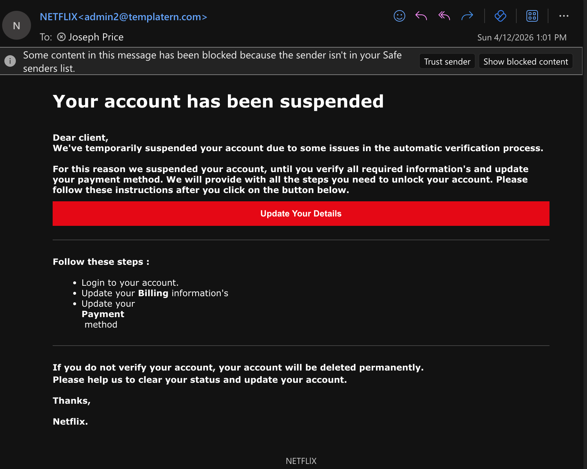
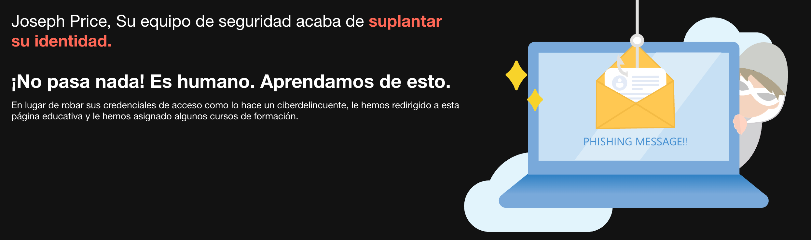
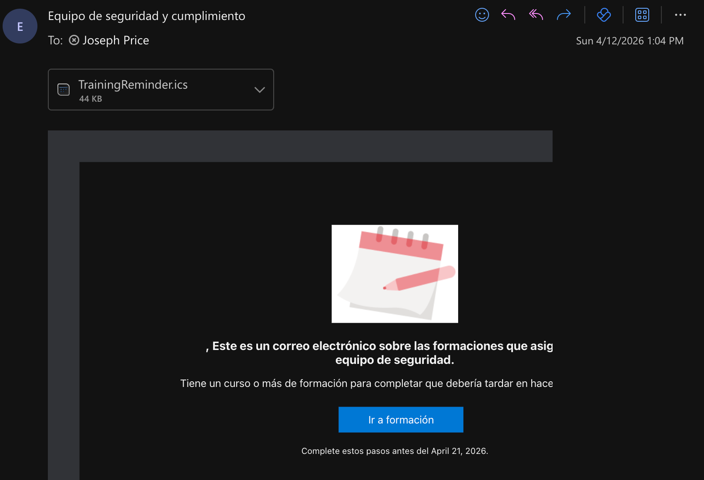
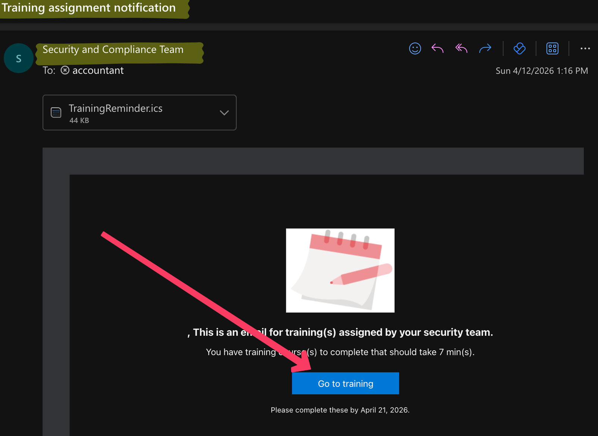
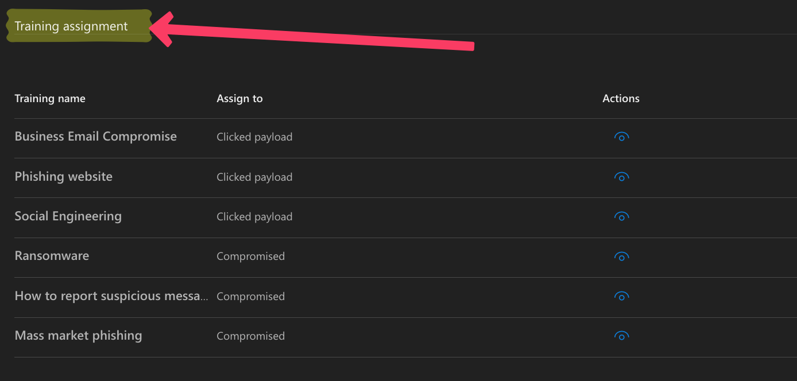
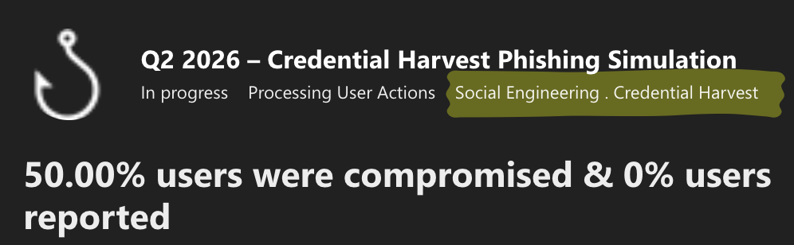
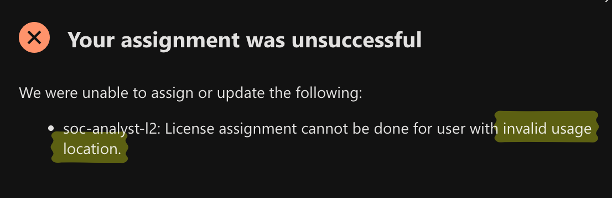
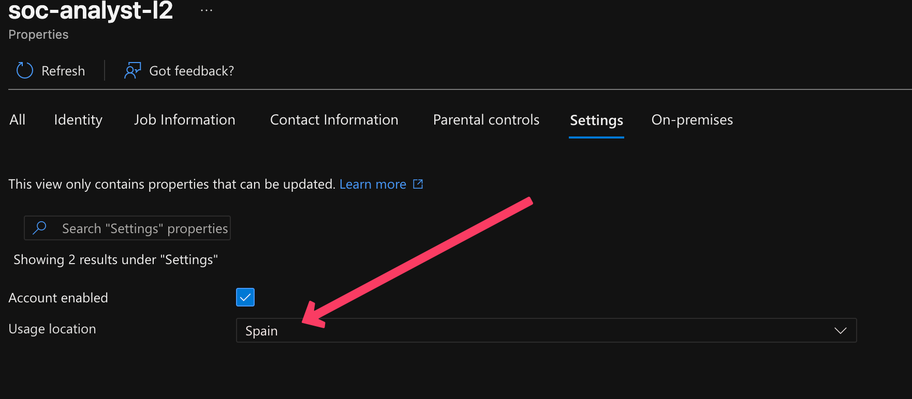
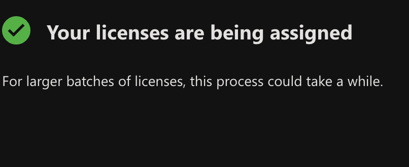

# Attack Simulation Training: Credential Harvest Campaign & Security Posture Analysis

## Overview
Human error remains one of the largest vulnerabilities in any corporate environment. The objective of this project was to design, execute, and analyze a corporate-wide phishing simulation using the **Attack Simulation Training** capability within Microsoft Defender for Office 365. 

This project demonstrates the ability to launch credential harvesting campaigns, automatically assign localized remedial training to compromised users, analyze campaign metrics, and troubleshoot underlying Microsoft Entra ID licensing issues.

**Limitations & Honest Caveats:**
> *This simulation was conducted in a personal Microsoft 365 E5 tenant with two user accounts. In a production environment, campaign scope, payload diversity, and baseline measurement across multiple waves would be needed before drawing conclusions about an organization's true risk posture.*

---

## Executive Summary & Key Findings
Following the conclusion of the simulated campaign, the telemetry provided a clear baseline of the organization's human-layer security posture:

* **50.00% Compromise Rate (Credential Submission):** A 50% credential submission rate on a first simulation is consistent with industry benchmarks for untrained populations — providing a clear baseline for measuring improvement over subsequent campaigns.
* **0% Reporting Rate (Critical Gap):** The 0% reporting rate is actually the more alarming finding. It indicates that even users who recognized the simulation as suspicious did not escalate it — a gap that no technical control can compensate for. A healthy reporting culture is the SOC's most valuable human detection layer.

---

## Tools, Technologies & Frameworks
- **Platform:** Microsoft Defender for Office 365, Microsoft Entra ID
- **Security Domain:** Insider Risk, Security Awareness, Social Engineering
- **MITRE ATT&CK Mapping:** 
  - **T1566.002** — Spearphishing Link
  - **T1598.003** — Spearphishing Link (for credential access)
- **Troubleshooting:** Microsoft 365 E5 License Provisioning & Identity Management

---

## Phase 1: Technical Setup & Simulation Design
To assess user awareness against realistic threats, I configured a Credential Harvesting campaign using a localized, brand-impersonation payload.

**Simulation Parameters:**
- **Technique:** Credential Harvest
- **Payload:** "Netflix account suspension" (Designed to create a false sense of urgency).
- **Automation:** Configured to automatically assign educational training to any user who clicked the malicious payload or entered their credentials.

---

## Phase 2: Execution & Payload Delivery
The payload was designed to bypass standard spam filters due to internal simulation routing, landing directly in the target users' inboxes.

---

## Phase 3: Educational Interception & Automated Remediation
When a user falls victim to the simulation, the system immediately intervenes, turning the security failure into a "teachable moment."

### 1. Educational Interception
Upon clicking the malicious link, the user was redirected to a Microsoft Defender educational landing page explaining the indicators of phishing they missed.

### 2. Multi-Lingual Training Assignment
Following the interception, Defender for Office 365 automatically assigned targeted remedial training to the compromised users based on their localized language settings.

---

## Phase 4: Analytics & Strategic Recommendations
With the baseline metrics established (50% compromise, 0% reporting), I analyzed the payload engagement details to formulate actionable security recommendations.

**Strategic Recommendations:**
1. **Zero Trust Enforcement:** Enable stricter Microsoft Entra Conditional Access policies (e.g., requiring phishing-resistant MFA) to mitigate the impact of harvested credentials.
2. **Cultural Shift via Testing:** Shift from quarterly to monthly Attack Simulation Training to build user muscle memory specifically around utilizing the "Report Phishing" button.
3. **Targeted Payloads:** Deploy custom, role-specific payloads based on real-world threat intelligence rather than generic consumer brands.
4. **SIEM Integration:** Integrate simulation results with Microsoft Sentinel to correlate repeat offenders with higher user-risk scores.

---

## Addendum: Troubleshooting Entra ID Identity Provisioning
During the environment setup phase, I encountered a critical identity management issue when attempting to assign a Microsoft 365 E5 license to a simulated SOC Analyst user account. 

**The Error:**
License assignment failed with the error: *"License assignment cannot be done for user with invalid usage location."*

**Root Cause & Resolution:**
1. **Investigation:** Microsoft 365 requires a `UsageLocation` attribute to be set on user objects to comply with regional service availability and data residency laws. The user was created without this mandatory attribute.
2. **Resolution:** I navigated to Microsoft Entra ID, accessed the user's properties, and defined the Usage Location (e.g., Spain).
3. **Validation:** Following the attribute update, the E5 license was successfully assigned.
   

